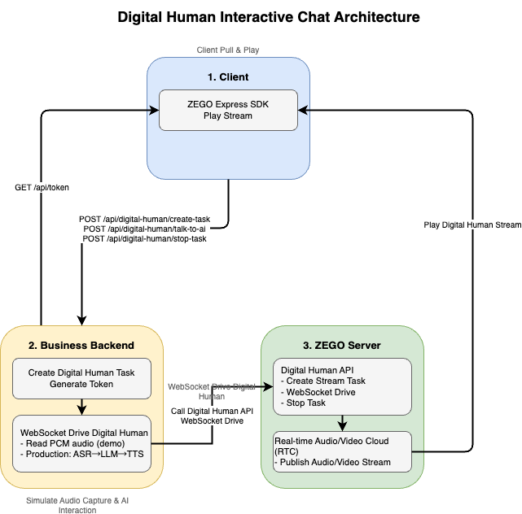
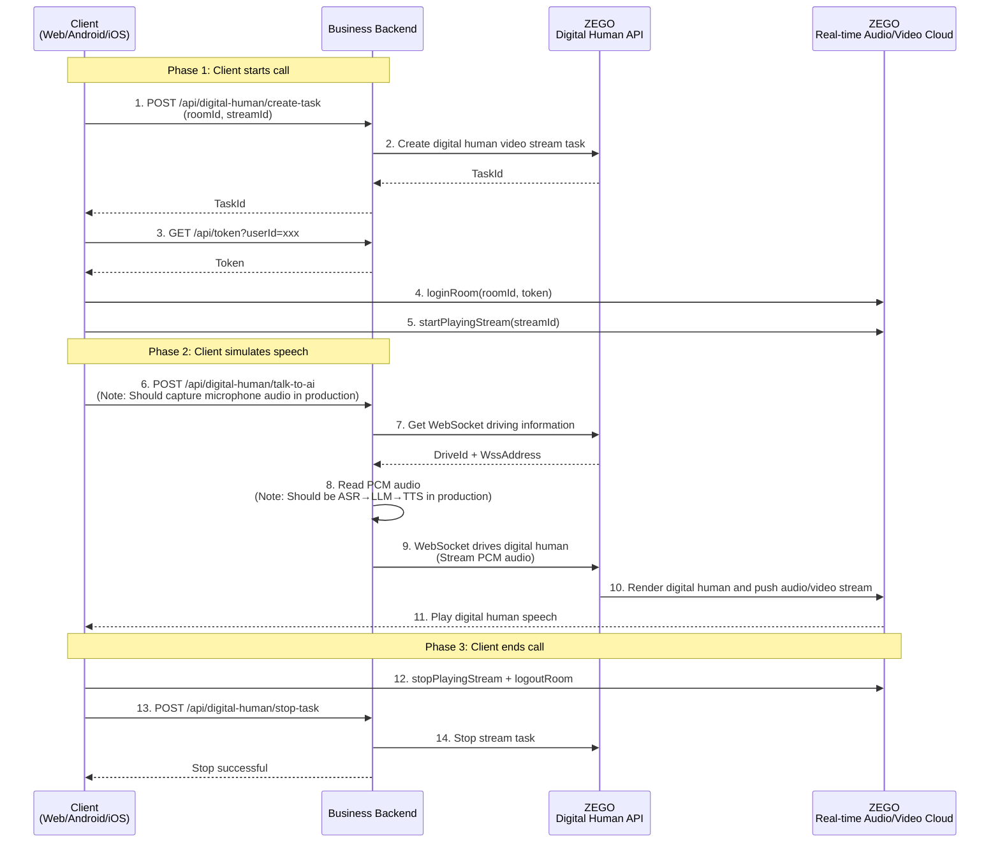

[中文](README.md) | [English](README.en.md)

# Digital Human Interactive Chat Example

This example demonstrates the complete process of real-time interactive conversation between clients and digital humans. The client simulates audio capture, and the business backend processes the captured audio through ASR → LLM → TTS, then drives the digital human via WebSocket, while the client streams and plays the audio/video.

## 1. Core Architecture

The digital human interactive chat system consists of two core roles:

### 1. Client
- **Functionality**: Simulates audio capture, calls business backend AI interaction API, streams and plays digital human audio/video
- **Platforms**: Web / Android / iOS, all using ZEGO Express SDK for streaming playback
- **API Endpoints**:
  - `POST /api/digital-human/create-task` - Create digital human task
  - `GET /api/token` - Get ZEGO Token for ZEGO Express SDK
  - `POST /api/digital-human/talk-to-ai` - Simulate user speech for AI interaction
  - `POST /api/digital-human/stop-task` - Stop digital human task

### 2. Business Backend
- **Functionality**: Create digital human tasks, drive digital human via WebSocket, generate RTC Token
- **API Endpoints**:
  - ZEGO Digital Human API: Create tasks, get WebSocket driving information, stop tasks

### 3. ZEGO Server
- **Digital Human API**: Create digital human video stream tasks, WebSocket-driven digital human, stop tasks
- **Real-time Audio/Video Cloud**: Digital human audio/video streams are pushed via ZEGO real-time audio/video cloud, clients pull via Express SDK

### Architecture Diagram



---

## 2. Business Process Sequence Diagram



---

## 3. Business Backend API Reference

### POST /api/digital-human/create-task

Create a digital human video stream task.

**Request Parameters**:
```json
{
  "roomId": "string",
  "streamId": "string"
}
```

**Parameter Description**:
| Parameter | Description |
|------|------|
| `roomId` | RTC room ID. **Each user should use a different roomId** to avoid multiple users entering the same room |
| `streamId` | Stream ID for digital human streaming. The server will use this streamId to create a digital human streaming task |

**Note**: `digitalHumanId` is configured by server environment variables, no need for client to pass.

**Response Example**:
```json
{
  "success": true,
  "taskId": "string"
}
```

**Response Field Description**:
| Field | Description |
|------|------|
| `taskId` | Digital human task ID, used for subsequent AI interaction and stopping tasks |

### POST /api/digital-human/talk-to-ai

Simulate AI interaction, drive digital human broadcasting via WebSocket.

**Request Parameters**:
```json
{
  "taskId": "string"
}
```

**Response Example**:
```json
{
  "success": true,
  "message": "AI interaction completed"
}
```

**Note**: In production, you should capture microphone audio → ASR speech recognition → LLM generates response → TTS speech synthesis → WebSocket drives digital human. This example simplifies by reading a preset PCM file.

### POST /api/digital-human/stop-task

Stop the digital human video stream task.

**Request Parameters**:
```json
{
  "taskId": "string"
}
```

**Response Example**:
```json
{
  "success": true,
  "message": "Digital human task stopped"
}
```

### GET /api/token

Generate ZEGO SDK Token.

**Request Parameters**: `userId` (query parameter)

**Response Example**:
```json
{
  "success": true,
  "token": "string"
}
```

---

## 4. Client Integration Examples

### 1. Web Client Integration Example

Web client uses ZEGO Express SDK for streaming playback:

```javascript
// Step 1: Create digital human task
// Note: roomId should be unique for each user, streamId is the stream ID for digital human streaming
const roomId = 'room_' + Date.now();  // Different roomId for each user
const streamId = 'stream_' + Date.now();  // Stream ID for digital human streaming

const createRes = await fetch('/api/digital-human/create-task', {
  method: 'POST',
  headers: { 'Content-Type': 'application/json' },
  body: JSON.stringify({
    roomId: roomId,
    streamId: streamId
  })
});
const { taskId } = await createRes.json();
// Server only returns taskId. roomId and streamId use client-generated values

// Step 2: Get Token
const userId = 'user_001';
const tokenRes = await fetch(`/api/token?userId=${userId}`);
const { token } = await tokenRes.json();

// Step 3: Initialize Express SDK
const { ZegoExpressEngine } = await import('zego-express-engine-webrtc');
const engine = new ZegoExpressEngine(appId, "");

// Step 4: Login to RTC room
await engine.loginRoom(roomId, token, {
  userID: userId,
  userName: userId
});

// Step 5: Pull digital human audio/video stream
const remoteStream = await engine.startPlayingStream(streamId);
const remoteView = engine.createRemoteStreamView(remoteStream);
remoteView.play('remote-video'); // Render to DOM element

// Step 6: Simulate speech
await fetch('/api/digital-human/talk-to-ai', {
  method: 'POST',
  headers: { 'Content-Type': 'application/json' },
  body: JSON.stringify({ taskId })
});

// Step 7: End call
await engine.stopPlayingStream(streamId);
await engine.logoutRoom();
await fetch('/api/digital-human/stop-task', {
  method: 'POST',
  headers: { 'Content-Type': 'application/json' },
  body: JSON.stringify({ taskId })
});
```

### 2. Android Client Integration Example

Android client uses ZEGO Express SDK for streaming playback:

```java
// Step 1: Create digital human task
// POST /api/digital-human/create-task
// Request body: { "roomId": "room_xxx", "streamId": "stream_xxx" }
// Note: roomId should be unique for each user, streamId is the stream ID for digital human streaming
// Server returns: { "taskId": "task_001" }

// Step 2: Initialize Express SDK
ZegoEngineProfile profile = new ZegoEngineProfile();
profile.appID = appId;
profile.scenario = ZegoScenario.HIGH_QUALITY_CHATROOM;
ZegoExpressEngine.createEngine(profile, null);

// Step 3: Login to room and pull stream (using client-defined roomId and streamId)
ZegoUser user = new ZegoUser(userId, userId);
ZegoRoomConfig config = new ZegoRoomConfig();
config.token = token;
ZegoExpressEngine.getEngine().loginRoom(roomId, user, config, (errorCode, extendedData) -> {
    if (errorCode == 0) {
        // Use ZegoCanvas to wrap TextureView for rendering
        ZegoCanvas canvas = new ZegoCanvas(findViewById(R.id.remote_video_view));
        ZegoExpressEngine.getEngine().startPlayingStream(streamId, canvas);
    }
});

// Step 4: Simulate speech (call business backend API)
// POST /api/digital-human/talk-to-ai
// Request body: { "taskId": "xxx" }

// Step 5: End call
ZegoExpressEngine.getEngine().stopPlayingStream(streamId);
ZegoExpressEngine.getEngine().logoutRoom();
// POST /api/digital-human/stop-task
// Request body: { "taskId": "xxx" }
```

### 3. iOS Client Integration Example

iOS client uses ZEGO Express SDK for streaming playback:

```objc
// Step 1: Create digital human task
// POST /api/digital-human/create-task
// Request body: { "roomId": "room_xxx", "streamId": "stream_xxx" }
// Note: roomId should be unique for each user, streamId is the stream ID for digital human streaming
// Server returns: { "taskId": "task_001" }

// Step 2: Initialize Express SDK
ZegoEngineProfile *profile = [[ZegoEngineProfile alloc] init];
profile.appID = (unsigned int)appId;
profile.scenario = ZegoScenarioHighQualityChatroom;
self.expressEngine = [ZegoExpressEngine createEngineWithProfile:profile eventHandler:self];

// Step 3: Login to room and pull stream (using client-generated roomId and streamId)
ZegoUser *user = [[ZegoUser alloc] init];
user.userID = userId;
user.userName = userId;
ZegoRoomConfig *roomConfig = [[ZegoRoomConfig alloc] init];
roomConfig.token = token;
[self.expressEngine loginRoom:roomId user:user config:roomConfig callback:^(int errorCode, NSDictionary *extendedData) {
    if (errorCode == 0) {
        // Use ZegoCanvas to wrap UIView for rendering
        ZegoCanvas *canvas = [ZegoCanvas canvasWithView:self.remoteVideoView];
        [self.expressEngine startPlayingStream:streamId canvas:canvas];
    }
}];

// Step 4: Simulate speech (call business backend API)
// POST /api/digital-human/talk-to-ai
// Request body: { "taskId": "xxx" }

// Step 5: End call
[self.expressEngine stopPlayingStream:streamId];
[self.expressEngine logoutRoom];
// POST /api/digital-human/stop-task
// Request body: { "taskId": "xxx" }
```

---

## 5. Detailed Documentation for Each Platform

- [Business Backend Detailed Documentation](./server/README.md)
- [Web (React) Client Detailed Documentation](./web-react/README.md)
- [Web (Vue) Client Detailed Documentation](./web-vue/README.md)
- [Android Client Detailed Documentation](./android/README.md)
- [iOS (Objective-C) Client Detailed Documentation](./ios-oc/README.md)

---

## 6. Important Notes

- Business backend uses preset PCM files to simulate AI interaction; production should integrate ASR, LLM, TTS services
- Token generation requires Token04 algorithm, ensure `SERVER_SECRET` is kept secure
- Client must stop streaming, exit room, and stop digital human task when destroying
- **Each user should use a different roomId** to avoid interference from multiple users entering the same room
- Client-defined streamId is the stream ID for digital human streaming; client uses this streamId to pull and play
