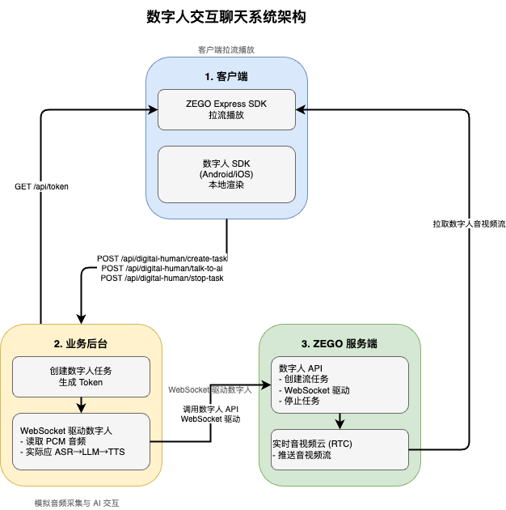
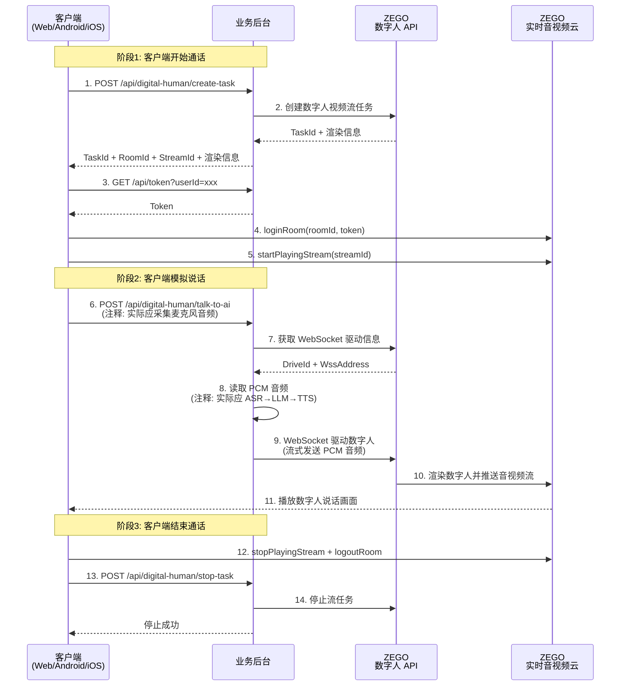

# 数字人交互聊天示例

本示例演示客户端与数字人实时交互对话的完整流程。客户端模拟音频采集，业务后台将采集的音频经过 ASR -> LLM -> TTS 处理后，通过 WebSocket 驱动数字人，客户端拉流播放。

## 一、核心架构

数字人交互聊天系统由两个核心角色组成：

### 1. 客户端
- **功能**：模拟音频采集，调用业务后台 AI 交互接口，拉流播放数字人音视频
- **平台**：
  - Web：使用 ZEGO Express SDK 拉流播放
  - Android/iOS：使用 ZEGO Express SDK 拉流 + 数字人 SDK 渲染
- **调用接口**：
  - `POST /api/digital-human/create-task` - 创建数字人任务
  - `GET /api/token` - 获取 RTC Token
  - `POST /api/digital-human/talk-to-ai` - 模拟用户说话与 AI 交互
  - `POST /api/digital-human/stop-task` - 停止数字人任务

### 2. 业务后台
- **功能**：创建数字人任务，通过 WebSocket 驱动数字人，生成 RTC Token
- **调用接口**：
  - ZEGO 数字人 API：创建任务、获取 WebSocket 驱动信息、停止任务

### 3. ZEGO 服务端
- **数字人 API**：创建数字人视频流任务、WebSocket 驱动数字人、停止任务
- **实时音视频云**：数字人音视频流通过 ZEGO 实时音视频云推送，客户端通过 Express SDK 拉取

### 架构图



---

## 二、业务流程时序图



---

## 三、业务后台 API 接口说明

### POST /api/digital-human/create-task

创建数字人视频流任务。

**请求参数**:
```json
{
  "digitalHumanId": "string",
  "roomId": "string",
  "streamId": "string",
  "outputMode": 1  // 1=Web模式, 2=Mobile模式
}
```

**响应示例**:
```json
{
  "success": true,
  "taskId": "string",
  "roomId": "string",
  "streamId": "string",
  "digitalHumanId": "string",
  "clientInferencePackageUrl": "string",  // Mobile 模式需要
  "isSupportSmallImageMode": boolean       // Mobile 模式需要
}
```

**输出模式说明**

| 模式 | outputMode | 适用客户端 | 说明 |
|------|------------|--------|------|
| Web 模式 | 1 | Web 客户端 | ZEGO Express SDK 直接播放 |
| Mobile 模式 | 2 | Android/iOS 客户端 | ZEGO Express SDK 拉流 + 数字人 SDK 渲染。性能更好。 |

### POST /api/digital-human/talk-to-ai

模拟 AI 交互，通过 WebSocket 驱动数字人播报。

**请求参数**:
```json
{
  "taskId": "string"
}
```

**响应示例**:
```json
{
  "success": true,
  "message": "AI interaction completed"
}
```

**注释说明**：实际业务中应采集麦克风音频 → ASR 语音识别 → LLM 生成回复 → TTS 语音合成 → WebSocket 驱动数字人。本示例简化为读取预置 PCM 文件。

### POST /api/digital-human/stop-task

停止数字人视频流任务。

**请求参数**:
```json
{
  "taskId": "string"
}
```

**响应示例**:
```json
{
  "success": true,
  "message": "Digital human task stopped"
}
```

### GET /api/token

生成 ZEGO SDK Token。

**请求参数**: `userId` (查询参数)

**响应示例**:
```json
{
  "success": true,
  "token": "string"
}
```

---

## 四、客户端接入示例

### 1. Web 客户端接入示例

Web 客户端使用 ZEGO Express SDK 拉流播放：

```javascript
// 步骤1: 创建数字人任务
const createRes = await fetch('/api/digital-human/create-task', {
  method: 'POST',
  headers: { 'Content-Type': 'application/json' },
  body: JSON.stringify({
    digitalHumanId: 'dh_001',
    roomId: 'room_001',
    streamId: 'stream_001',
    outputMode: 1  // Web 模式
  })
});
const { taskId, roomId, streamId } = await createRes.json();

// 步骤2: 获取 Token
const userId = 'user_001';
const tokenRes = await fetch(`/api/token?userId=${userId}`);
const { token } = await tokenRes.json();

// 步骤3: 初始化 Express SDK
const { ZegoExpressEngine } = await import('zego-express-engine-webrtc');
const engine = new ZegoExpressEngine(appId, "");

// 步骤4: 登录 RTC 房间
await engine.loginRoom(roomId, token, {
  userID: userId,
  userName: userId
});

// 步骤5: 拉取数字人音视频流
const remoteStream = await engine.startPlayingStream(streamId);
const remoteView = engine.createRemoteStreamView(remoteStream);
remoteView.play('remote-video'); // 渲染到 DOM 元素

// 步骤6: 模拟说话
await fetch('/api/digital-human/talk-to-ai', {
  method: 'POST',
  headers: { 'Content-Type': 'application/json' },
  body: JSON.stringify({ taskId })
});

// 步骤7: 结束通话
await engine.stopPlayingStream(streamId);
await engine.logoutRoom();
await fetch('/api/digital-human/stop-task', {
  method: 'POST',
  headers: { 'Content-Type': 'application/json' },
  body: JSON.stringify({ taskId })
});
```

### 2. Android/iOS 客户端接入示例

移动端需要使用 Express SDK 拉流 + 数字人 SDK 渲染：

```java
// Android 示例

// 步骤1: 创建数字人任务（outputMode=2）
// 服务端返回：
// {
//   "taskId": "task_001",
//   "roomId": "room_001",
//   "streamId": "stream_001",
//   "digitalHumanId": "dh_001",
//   "clientInferencePackageUrl": "https://...",
//   "isSupportSmallImageMode": true
// }

// 步骤2: 初始化 Express SDK
ZegoEngineProfile profile = new ZegoEngineProfile();
profile.appID = appId;
profile.scenario = ZegoScenario.HIGH_QUALITY_CHATROOM;
ZegoExpressEngine.createEngine(profile, null);

// 步骤3: 初始化数字人 SDK
IZegoDigitalMobile digitalMobile = ZegoDigitalHuman.create(context);

// 步骤4: 生成 base64Config
String base64Config = generateBase64Config(
    digitalHumanId,
    roomId,
    streamId,
    clientInferencePackageUrl,
    isSupportSmallImageMode
);

// 步骤5: 启动数字人 SDK
digitalMobile.attach(findViewById(R.id.digital_human_view));
digitalMobile.start(base64Config, listener);

// 步骤6: 登录房间并拉流
ZegoExpressEngine.getEngine().loginRoom(roomId, new ZegoUser(userId), token);
ZegoExpressEngine.getEngine().startPlayingStream(streamId);

// 步骤7: 透传视频帧和 SEI 数据给数字人 SDK
ZegoExpressEngine.getEngine().setCustomVideoRenderHandler(new IZegoCustomVideoRenderHandler() {
    @Override
    public void onRemoteVideoFrameRawData(ByteBuffer[] data, int[] dataLength,
                                         ZegoVideoFrameParam param, String streamID) {
        digitalMobile.onRemoteVideoFrameRawData(data, dataLength, convertParam(param), streamID);
    }
});

ZegoExpressEngine.getEngine().setEventHandler(new IZegoEventHandler() {
    @Override
    public void onPlayerSyncRecvSEI(String streamID, byte[] data) {
        digitalMobile.onPlayerSyncRecvSEI(streamID, data);
    }
});

// 步骤8: 模拟说话（调用业务后台接口）
// POST /api/digital-human/talk-to-ai

// 步骤9: 结束通话
digitalMobile.stop();
ZegoExpressEngine.getEngine().stopPlayingStream(streamId);
ZegoExpressEngine.getEngine().logoutRoom();
// POST /api/digital-human/stop-task
```

---

## 五、各端示例代码详细说明

- [业务后台示例代码详细说明](./server/README.md)
- [Web(React) 端示例代码详细说明](./web-react/README.md)
- [Web(Vue) 端示例代码详细说明](./web-vue/README.md)
- [Android 端示例代码详细说明](./android/README.md)
- [iOS(Objective-C) 端示例代码详细说明](./ios-oc/README.md)

---

## 六、注意事项

- 业务后台使用预置 PCM 文件模拟 AI 交互，实际业务应接入 ASR、LLM、TTS 服务
- Token 生成需要使用 Token04 算法，确保 `SERVER_SECRET` 安全
- 客户端销毁时需停止拉流、退出房间、停止数字人任务
