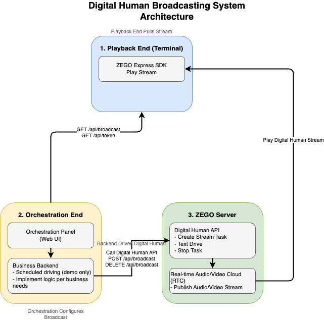
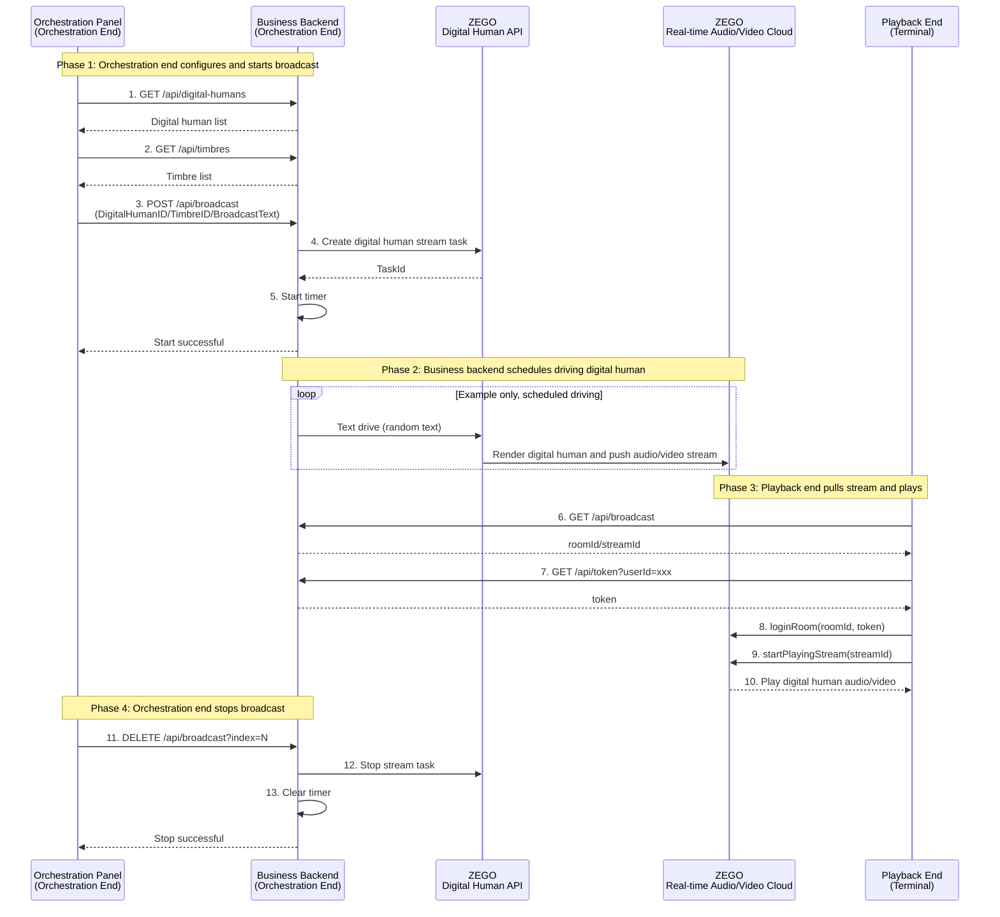

[中文](README.md) | [English](README.en.md)

# Digital Human Broadcasting System Example

This example demonstrates the **three-party architecture** of digital human broadcasting: Orchestration end configures broadcast content → Business backend drives digital human → Playback end streams and plays.

## 1. Core Architecture

The digital human broadcasting system consists of three core roles:

### 1. Playback End (Terminal)
- **Functionality**: Use ZEGO Express SDK to pull and play digital human audio/video streams
- **Platforms**: Web / Android / iOS, all use Express SDK for streaming playback
- **API Endpoints**:
  - `GET /api/broadcast` - Get broadcast information (roomId/streamId)
  - `GET /api/token` - Get RTC Token

### 2. Orchestration End (Orchestration Panel + Business Service)
- **Orchestration Panel**: Web UI for configuring digital human broadcast content
  - Select digital human avatar and timbre
  - Configure broadcast text content
  - Start/Stop broadcast tasks
- **Business Service** (this service): Receive orchestration commands, call ZEGO Digital Human API to drive digital human
- **API Endpoints**:
  - `GET /api/digital-humans` - Get digital human list
  - `GET /api/timbres` - Get timbre list
  - `POST /api/broadcast` - Start broadcast task
  - `DELETE /api/broadcast` - Stop broadcast task

### 3. ZEGO Server
- **Digital Human API**: Create digital human video stream tasks, text-driven digital human, audio-driven digital human, stop digital human video stream tasks
- **Real-time Audio/Video Cloud**: Digital human audio/video streams are pushed via ZEGO real-time audio/video cloud, playback end pulls via ZEGO Express SDK

### Architecture Diagram



---

## 2. Business Process Sequence Diagram



---

## 3. Business Backend API Reference

The business backend provides two types of interfaces, called by the orchestration end and playback end respectively:

### 1. Orchestration End Interfaces

The orchestration end (orchestration panel) calls the following interfaces to configure and manage broadcast tasks:

| Endpoint | Method | Request Parameters | Description |
|------|------|---------|------|
| `/api/digital-humans` | GET | - | Get digital human list |
| `/api/timbres` | GET | `digitalHumanId` (optional) | Get timbre list |
| `/api/broadcast` | POST | `digitalHumanId`, `timbreId`, `roomId`, `streamId`, `textPool` | Start broadcast task |
| `/api/broadcast?index=N` | DELETE | `index` (query parameter) | Stop specified broadcast task |

**POST /api/broadcast Request Example:**

Where:
- digitalHumanId, timbreId, roomId, streamId are parameters required by ZEGO Digital Human API
- broadcastIndex and textPool are parameters for this business service demonstration. Production should implement according to requirements.

```json
{
  "broadcastIndex": 0,
  "textPool": ["Welcome", "Please wait"],
  "digitalHumanId": "dh_001",
  "timbreId": "timbre_001",
  "roomId": "room_001",
  "streamId": "stream_001"
}
```

### 2. Playback End Interfaces

The playback end (terminal) calls the following interfaces to get playback information:

| Endpoint | Method | Request Parameters | Description |
|------|------|---------|------|
| `/api/broadcast` | GET | - | Get broadcast list information (includes roomId/streamId) |
| `/api/token` | GET | `userId` (query parameter) | Get Token for ZEGO client SDK |

**GET /api/broadcast Response Example:**

```json
{
  "broadcastList": {
    "0": {
      "taskId": "task_001",
      "roomId": "room_001",
      "streamId": "stream_001"
    }
  }
}
```

### 3. Playback End Integration Example (Web)

Web client uses ZEGO Express SDK for streaming playback:

```javascript
// Step 1: Get broadcast information
const broadcastRes = await fetch('/api/broadcast');
const { broadcastList } = await broadcastRes.json();
const { roomId, streamId } = Object.values(broadcastList)[0];

// Step 2: Get Token
const userId = 'terminal_001';
const tokenRes = await fetch(`/api/token?userId=${userId}`);
const { token } = await tokenRes.json();

// Step 3: Initialize Express SDK
const { ZegoExpressEngine } = await import('zego-express-engine-webrtc');
const engine = new ZegoExpressEngine(appId, "");

// Step 4: Login to RTC room
await engine.loginRoom(roomId, token, {
  userID: userId,
  userName: userId
});

// Step 5: Pull digital human audio/video stream
const remoteStream = await engine.startPlayingStream(streamId);
const remoteView = engine.createRemoteStreamView(remoteStream);
remoteView.play('remote-video'); // Render to DOM element
```

### 4. Playback End Integration Example (Android)

Android client uses ZEGO Express SDK for streaming playback:

```java
// Step 1: Get broadcast information
// GET /api/broadcast returns, take the first broadcast task as example:
// { "roomId": "room_001", "streamId": "stream_001" }

// Step 2: Initialize Express SDK
ZegoEngineProfile profile = new ZegoEngineProfile();
profile.appID = appId;
profile.scenario = ZegoScenario.HIGH_QUALITY_CHATROOM;
ZegoExpressEngine.createEngine(profile, null);

// Step 3: Login to room and pull stream
ZegoUser user = new ZegoUser(userId, userId);
ZegoRoomConfig config = new ZegoRoomConfig();
config.token = token;
ZegoExpressEngine.getEngine().loginRoom(roomId, user, config, (errorCode, extendedData) -> {
    if (errorCode == 0) {
        // Use ZegoCanvas to wrap TextureView for rendering
        ZegoCanvas canvas = new ZegoCanvas(findViewById(R.id.remote_video_view));
        ZegoExpressEngine.getEngine().startPlayingStream(streamId, canvas);
    }
});
```

### 5. Playback End Integration Example (iOS)

iOS client uses ZEGO Express SDK for streaming playback:

```objc
// Step 1: Get broadcast information
// GET /api/broadcast returns, take the first broadcast task as example:
// { "roomId": "room_001", "streamId": "stream_001" }

// Step 2: Initialize Express SDK
ZegoEngineProfile *profile = [[ZegoEngineProfile alloc] init];
profile.appID = (unsigned int)appId;
profile.scenario = ZegoScenarioHighQualityChatroom;
self.expressEngine = [ZegoExpressEngine createEngineWithProfile:profile eventHandler:self];

// Step 3: Login to room and pull stream
ZegoUser *user = [[ZegoUser alloc] init];
user.userID = userId;
user.userName = userId;
ZegoRoomConfig *roomConfig = [[ZegoRoomConfig alloc] init];
roomConfig.token = token;
[self.expressEngine loginRoom:roomId user:user config:roomConfig callback:^(int errorCode, NSDictionary *extendedData) {
    if (errorCode == 0) {
        // Use ZegoCanvas to wrap UIView for rendering
        ZegoCanvas *canvas = [ZegoCanvas canvasWithView:self.remoteVideoView];
        [self.expressEngine startPlayingStream:streamId canvas:canvas];
    }
}];
```

---

## 4. Detailed Documentation for Each Platform

- [Business Backend Detailed Documentation](./server/README.md)
- [Web (React) Client Detailed Documentation](./web-react/README.md)
- [Web (Vue) Client Detailed Documentation](./web-vue/README.md)
- [Android Client Detailed Documentation](./android/README.md)
- [iOS (Objective-C) Client Detailed Documentation](./ios-oc/README.md)

---

## 5. Important Notes

- Business backend needs to properly manage broadcast task status (example uses global variables, production environment should use database)
- Token generation requires Token04 algorithm, ensure `SERVER_SECRET` is kept secure
- Scheduled driving is for demonstration only; production should implement driving logic according to requirements
